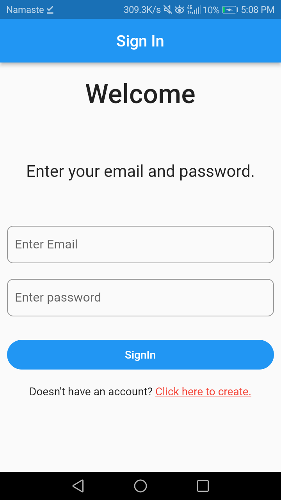
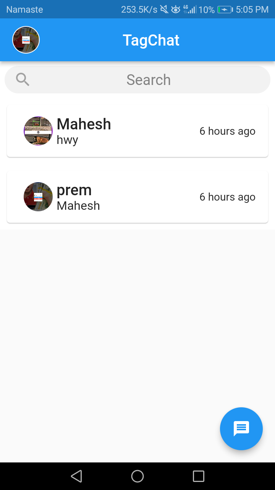
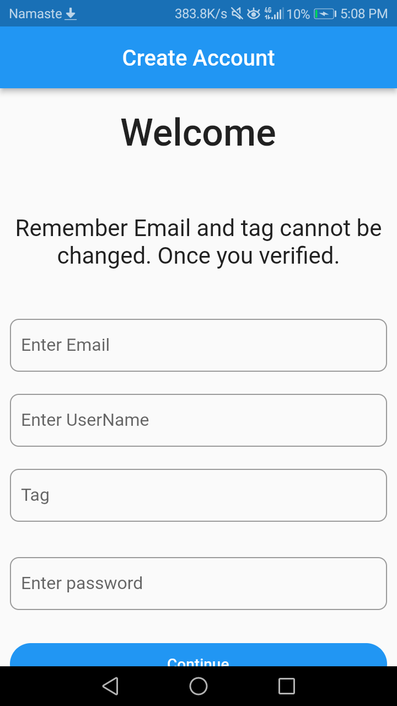
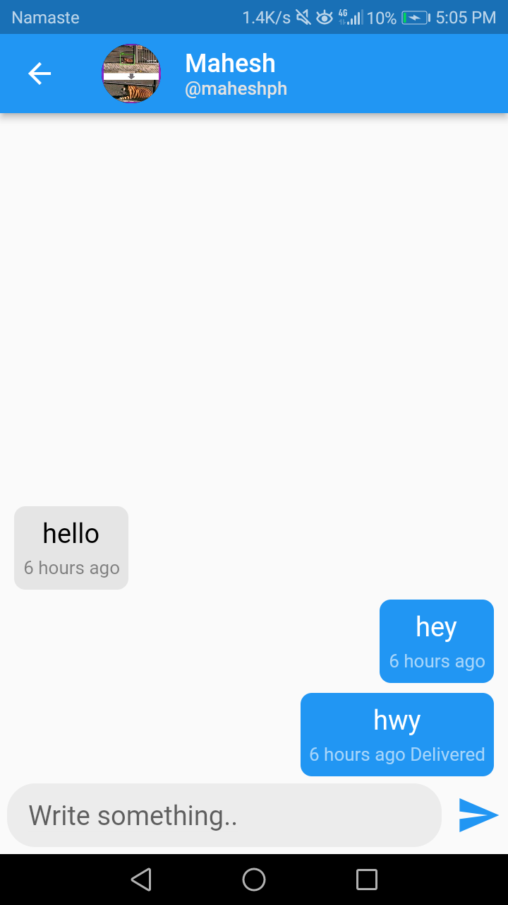
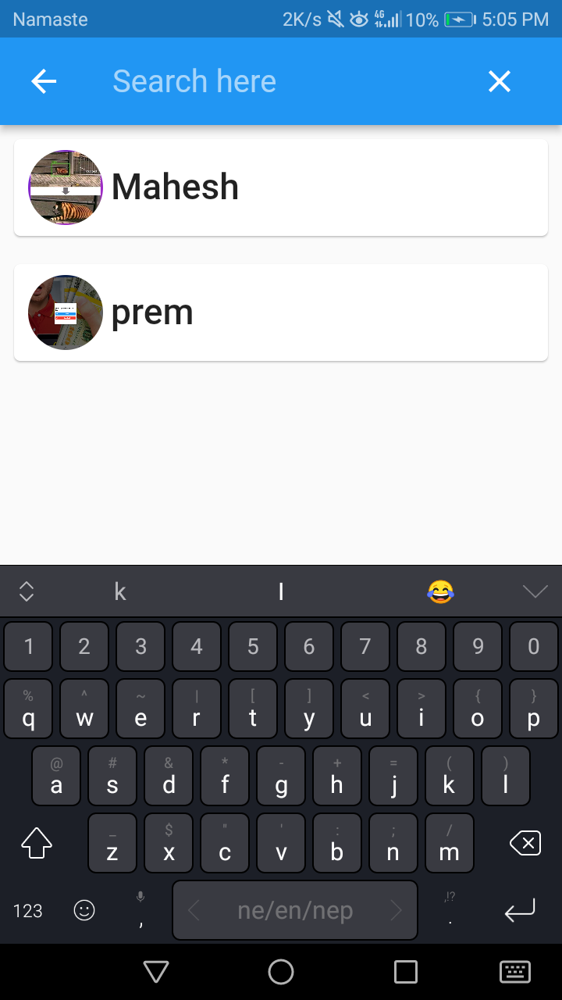
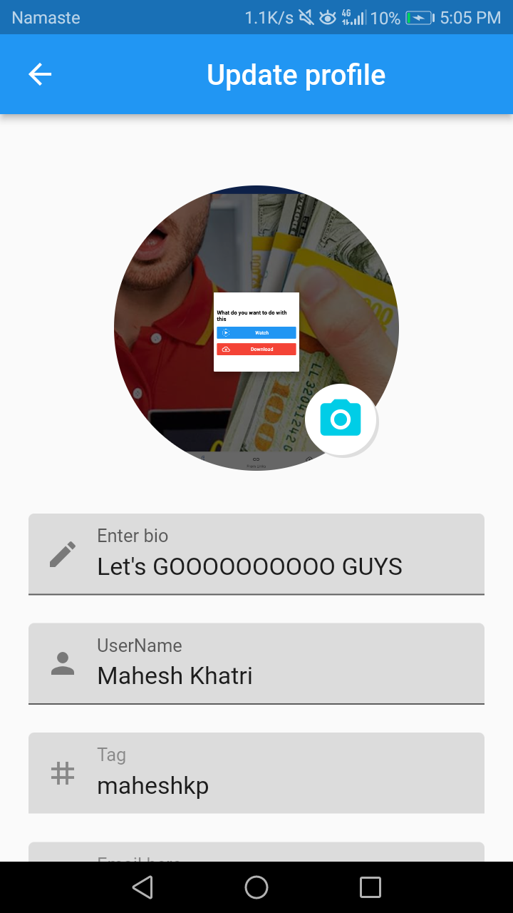

# TagChat
<h4>What is TagChat?</h4>

Tag chat is a simple and basic chat app created with flutter.

<h3>Description</h3>
<li>TagChat use firestore as backend</li>
<li>Currently it supports login with email and password.</li>
<li>You can add your name, email, bio, tag and profile picture</li>
<li>Tag is used to find people, it cannot be changed and must be unique</li>
<li>It supports last message, seen, sent time and text message</li>
<li>You can search people from your chatlist.</li>

<h3>ScreenShots</h3>

